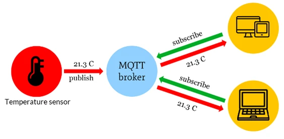
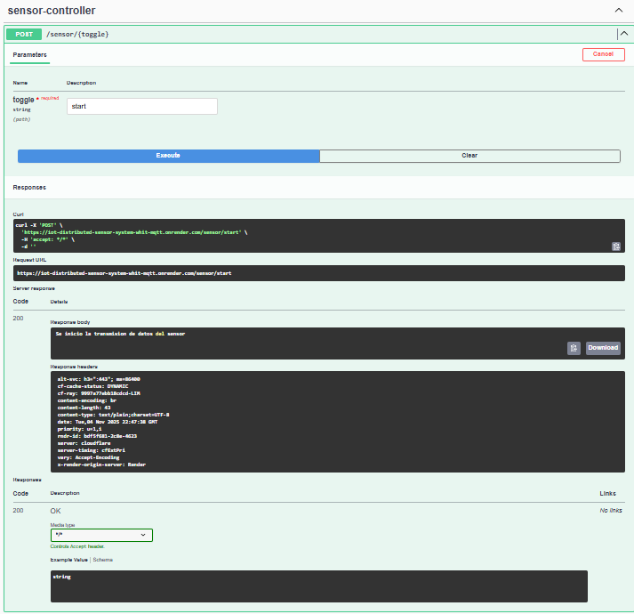

# IOT-_distributed_sensor_system_whit_MQTT

Esta aplicacion demuesrea una implementacion de la transmision de sensores
MQTT itilizando Spring Boot. Permite iniciar y detener la transmision de datos
de sensores y publicar mensajes en un brocker MQTT.




## Caracteristicas de la aplicacion:
- sensor/start : y sensor/stop son para la transmision de datos de los sensores.
- mqtt/message : es para publicar mensajes en un topic (tema) MQTT.
- mqtt/subscribe 

## Tecnologias utilizadas
- Java
- Spring Boot 
- protocolo MQTT ()
- Maven 

## Configuracion  de la aplicacion
 
- Se puede configurar la url del brocker MQTT  y los otros parametros en el application.properties.

- Configuracion que yo use: 

```
mqtt.broker.url=tcp://test.mosquitto.org:1883
mqtt.topic=test5555868/topic
mqtt.client.id=mqttSpringClient
mqtt.qos=2
```

## Endpoints de la api

```
# Endpoints de la api


```


## Terminos:

        - Qos:
        Qos En Mqtt define el nivel de garantia para que un mensaje sea 
        entregado por un editor a un suscriptor, es mas que todo un conjunto 
        de reglas qie se basan en la conexion TCP.

## Sensor Controller



curl -X 'POST' \
'https://iot-distributed-sensor-system-whit-mqtt.onrender.com/sensor/start' \
-H 'accept: */*' \
-d ''

# Mqtt Controller 