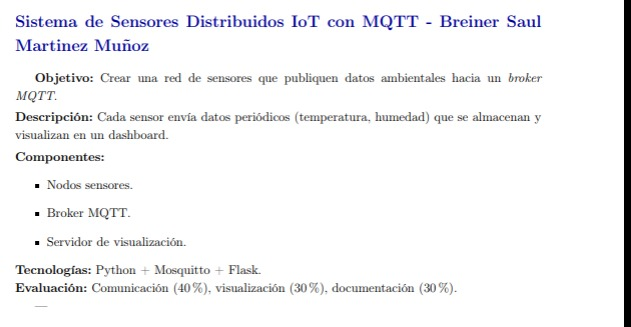

# IOT-_distributed_sensor_system_whit_MQTT

Esta aplicacion demuesrea una implementacion de la transmision de sensores
MQTT itilizando Spring Boot. Permite iniciar y detener la transmision de datos
de sensores y publicar mensajes en un brocker MQTT.




## Caracteristicas de la aplicacion:
- sensor/start : y sensor/stop son para la transmision de datos de los sensores.
- mqtt/message : es para publicar mensajes en un topic (tema) MQTT.
- mqtt/subscribe 

## Tecnologias utilizadas
- Java
- Spring Boot 
- protocolo MQTT ()
- Maven 

## Configuracion  de la aplicacion
 
- Se puede configurar la url del brocker MQTT  y los otros parametros en el application.properties.

- Configuracion que yo use: 

```
mqtt.broker.url=tcp://test.mosquitto.org:1883
mqtt.topic=test5555868/topic
mqtt.client.id=mqttSpringClient
mqtt.qos=2
```

## Endpoints de la api

```
# Endpoints de la api


```


## Terminos:

        - Qos:
        Qos En Mqtt define el nivel de garantia para que un mensaje sea 
        entregado por un editor a un suscriptor, es mas que todo un conjunto 
        de reglas qie se basan en la conexion TCP.

## Sensor Controller


curl -X 'POST' \
'https://iot-distributed-sensor-system-whit-mqtt.onrender.com/sensor/start' \
-H 'accept: */*' \
-d ''

# Mqtt Controller 


###  Clases creadas:

1. **`SensorNode`** - Modelo que representa cada nodo sensor con:
    - ID único (SENSOR-01, SENSOR-02, etc.)
    - Nombre descriptivo
    - Ubicación
    - Tópico MQTT asignado
    - Estado activo/inactivo

2. **`MultiSensorService`** - Servicio que gestiona:
    - Registro de múltiples nodos
    - Control individual de cada nodo (start/stop)
    - Control global (start-all/stop-all)
    - Transmisión simultánea en diferentes tópicos

3. **`MultiSensorController`** - Endpoints REST:
    - Registrar nodos
    - Consultar nodos
    - Iniciar/detener nodos individuales o todos

4. **`SensorNodesInitializer`** - Configuración automática que:
    - Crea 5 nodos sensores de ejemplo
    - Los registra al iniciar la aplicación
    - Puede iniciar todos o solo algunos automáticamente

###  Endpoints disponibles:

```
POST   /multi-sensor/register               - Registrar un nodo
POST   /multi-sensor/register-multiple      - Registrar múltiples nodos
GET    /multi-sensor/nodes                  - Obtener todos los nodos
GET    /multi-sensor/nodes/{nodeId}         - Obtener un nodo específico
POST   /multi-sensor/start/{nodeId}         - Iniciar nodo específico
POST   /multi-sensor/stop/{nodeId}          - Detener nodo específico
POST   /multi-sensor/start-all              - Iniciar todos los nodos
POST   /multi-sensor/stop-all               - Detener todos los nodos
GET    /multi-sensor/active                 - Obtener nodos activos
GET    /multi-sensor/active/{nodeId}        - Verificar si un nodo está activo
```

### Ejemplo de funcionamiento:

Cada nodo transmite de forma **independiente** en su propio tópico:
- SENSOR-01 → `sensors/office/temp-01`
- SENSOR-02 → `sensors/office/humidity-02`
- SENSOR-03 → `sensors/warehouse/temp-03`

